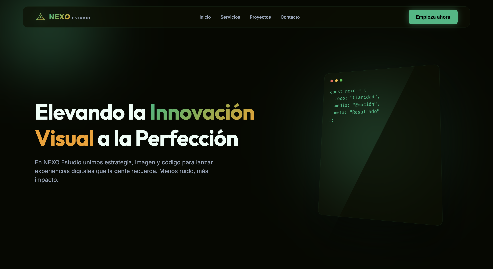

# NEXO Estudio — Landing de portafolio

Landing page de una sola página para una agencia de producción digital (marca y contenido de ejemplo). Forma parte de mi portafolio web como muestra de maquetación, sistema de diseño en CSS y animación ligera con JavaScript.

## Vista previa



## Stack

- **[Astro](https://astro.build/) 6** — sitio estático, componentes `.astro`
- **CSS** — variables, utilidades y estilos por componente (sin framework UI)
- **[GSAP](https://gsap.com/)** — entrada del hero, parallax en la tarjeta de código, animaciones al scroll (`ScrollTrigger`) y transiciones con respeto a `prefers-reduced-motion`

## Requisitos

- Node.js **≥ 22.12.0**

## Instalación y uso

```sh
npm install
npm run dev
```

El servidor de desarrollo queda en [http://localhost:4321](http://localhost:4321).

| Comando | Descripción |
| :------ | :---------- |
| `npm run dev` | Servidor de desarrollo |
| `npm run build` | Genera la versión de producción en `./dist/` |
| `npm run preview` | Previsualiza el build localmente |
| `npm run astro` | CLI de Astro (`astro check`, `astro add`, etc.) |

## Estructura del proyecto

```text
├── public/              # Estáticos (favicon, imágenes de proyecto)
├── src/
│   ├── components/      # Navigation, Hero, Services, Projects, Contact, Footer, Logo
│   ├── layouts/         # Layout.astro (shell HTML, fuentes, CSS global)
│   ├── pages/           # index.astro — composición de la landing
│   └── styles/          # global.css — tokens y utilidades
├── astro.config.mjs
└── package.json
```

## Secciones de la página

1. **Inicio** — hero con titular, copy y tarjeta tipo editor de código  
2. **Servicios** — tres bloques (producción visual, estrategia, desarrollo)  
3. **Proyectos** — grid de tres casos con ilustraciones SVG  
4. **Contacto** — datos, enlaces y formulario (front-end; sin backend conectado)  
5. **Pie** — mapa del sitio, contacto y créditos

## Despliegue

Cualquier hosting de sitios estáticos sirve el contenido de `./dist/` tras `npm run build` (por ejemplo Vercel, Netlify, Cloudflare Pages o GitHub Pages).

## Licencia y uso

Código y diseño de este repositorio son material de muestra para portafolio. Si reutilizas partes del proyecto, conserva la atribución o adapta la marca según tu caso.
